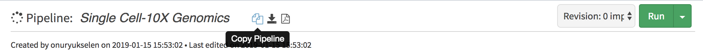
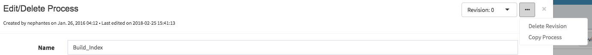

******************
Developer Tutorial
******************

This guide will walk you through how to start creating new pipelines.

Creating New Pipelines/Processes
================================

Basics of DolphinNext are explained in `Developer Tutorial <https://github.com/UMMS-Biocore/dolphinnext-tutorial>`_. You can use our `UMASS server  <https://dolphinnext.umassmed.edu/>`_, or easily pull Docker image of Dolphinnext and start creating pipelines in your local server.

**Overview of the Tutorial**
  * Tutorial Video
  * Exercise 1: Creating processes (FastQC, Hisat2, RSeQC)
  * Exercise 2: Building a pipeline
  * Exercise 3: Running a pipeline

You can also reach our reference DolphinNext documentation, using following links:
  * `Process Guide <process.html>`_ 
  * `Pipeline Guide <pipeline.html>`_

.. raw:: html

    

        <iframe src="https://www.youtube.com/embed/zfLXCgJFls4" frameborder="0" allowfullscreen style="position: absolute; top: 0; left: 0; width: 100%; height: 100%;"></iframe>
    

      

Copying Existing Processes/Pipelines
====================================

The simpliest way to edit pipelines is creating a copy of the existing ones by clicking **copy pipeline** icon which is located just next to pipeline title. 

    
Similarly you can create a copy of process by clicking **copy process** button on the top right of the process window.
    

    
Once you copied the pipeline/process, you will own all the  permissions of your process/pipeline and you can easily modify and save on your version.