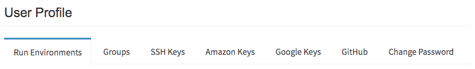
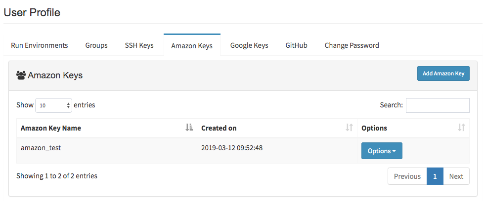
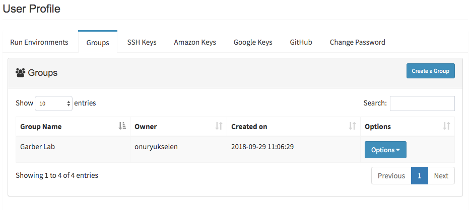

*************
Profile Guide
*************

This guide will walk you through all of your options within the Profile page.

Profile Page
============

Once logged in, click on the profile tab in the top right of the screen. You'll notice several tabs to explore in profile page.

First tab is the **run environments**. This is your main segment for creating connection profiles. Second tab is **groups** where you can create group and add members to it. Next section is the **SSH Keys**, where you can create new or enter existing SSH key pairs to establish connection to any kind of host. Fourth tab is called **Amazon Keys** where you enter your Amazon Web Services (AWS) security credentials to start/stop `Amazon EC2 instances <https://aws.amazon.com/ec2>`_.

.. tip:: Before creating run environment, **SSH Keys** needed to be created in SSH Keys tab. If you want to create Amazon EC2 instances and submit your jobs to Amazon Cloud, then both SSH and Amazon Key are required before specifying run environment.

SSH Keys
========

.. image:: dolphinnext_images/ssh_keys.png
	:align: center

In the SSH keys tab, you can create new or enter existing SSH key pairs by clicking on "Add SSH Key" button. By using Add SSH Keys window, enter the name of your keys and select the method you want to proceed: ``A. Use your own keys`` or ``B. Create new keys``.

* **A. Use your own keys:** If you choose "use your own keys", your private and public key pairs will be asked. You can reach your key pairs in your computer at default location: ``~/.ssh/id_rsa`` for private and ``~/.ssh/id_rsa.pub`` for public key. If these files are not exist or you want to create new ones, then on the command line, enter::

    ssh-keygen -t rsa

You will be prompted to supply a filename and a password. In order to accept the default filename (and location) for your key pair, press Enter without entering a filename. Your SSH keys will be generated using the default filename (``id_rsa`` and ``id_rsa.pub``).

* **B. Create new keys:** You will proceed by clicking generate keys button where new pair of ssh keys will be specifically produced for you. You should keep these keys in your default .ssh directory (``~/.ssh/id_rsa`` for private and ``~/.ssh/id_rsa.pub`` for public key). It is required to be adjust your public key permissions to 644 (-rw-r--r--) and private key permissions to 600 (-rw-------) by entering following commands::

    chmod -R 644 ~/.ssh/id_rsa
    chmod -R 600 ~/.ssh/id_rsa_pub

.. warning:: In both of the cases, private key will be used for submiting jobs in the host. Therefore, public key required to be added into ``~/.ssh/authorized_keys`` in the host by user. 

In order to add you private key to the host, you might use the following command::
	
	cat ~/.ssh/id_rsa.pub | ssh USERNAME@HOSTNAME "mkdir -p ~/.ssh && cat >> ~/.ssh/authorized_keys"
	
	
After inserting public key, connect to the host and make sure file permissions of ``authorized_keys`` and ``ssh`` folder is correct by following commands::

	chmod 700 ~/.ssh
	chmod 600 ~/.ssh/authorized_keys

Amazon Keys
===========

In the Amazon keys tab, you can enter your AWS security credentials (access key, secret key and default region) by clicking on "Add Amazon Key" button. Your information will be encrypted and kept secure. You will only have full access to editing and viewing the key information.

Groups
======

Groups tab is used to create groups by clicking on "Create a Group" button. After creating group, you can add members by clicking ``Options > Add User`` button. By using this group information, you can share your process, pipeline or projects with group members. In order to see current members of the group, you can click ``Options > View Group Members`` button. You can also delete your group by clicking ``Options > Delete Group`` button.

Run Environments
================

.. image:: dolphinnext_images/profile_runenv.png
	:align: center

This section is used for defining connection profiles by clicking on "Add Environment" button. Type options (A. Host or B. Amazon) will be prompted to user. You may choose "Host" option, if you are planing to submit jobs to specified hosts by using SSH Keys, or you may proceed with "Amazon" option to create Amazon EC2 instances and submit your jobs to Amazon Cloud.

A. Defining Host Profile:
=========================
* **Username/Hostname:** You should enter your username and hostname of the host which you would like to connect.  For instance, in order to connect ``us2r@ghpcc06.umassrc.org``, you would enter ``us2r`` as username and ``ghpcc06.umassrc.org`` as hostname.

.. note::  You don't need to add ``@`` sign while entering this information.

* **SSH Keys:** are saved in SSH keys tab and will be used while connecting to host.
* **Run Command (optional):** You may run the command or commands (by seperating each command with ``&&`` sign) before the nextflow job starts. eg. ``source /etc/bashrc && module load java/1.8.0_31 && module load bowtie2/2.3.2``
* **Nextflow Path (optional):** If nextflow path is not added to ``$PATH`` environment, you can define the path in this block. eg.``/project/umw_biocore/bin``
* **Executor of Nextflow/Executor of Nextflow Jobs:** You can determine the system where nextflow itself is initiated. Currently local, sge and lsf executors are supported by DolphinNext to initiate nextflow. Apart from the executor of nextflow, you may change the executor of each job by using "Executor of Nextflow Jobs" option. If any option other than local and ignite, is selected, additional settings will be prompt for ``Queue``, ``Memory(GB)``, ``CPU`` and ``Time(min.)``. Adjustment of these parameters are allowed for both options.

.. note::  For instance you may initiate nextflow in ``local`` and allow nextflow to run its jobs ``local``, ``sge``, ``lsf``, ``slurm`` or ``ignite``. Alternatively, selection both options to ``lsf`` or ``sge`` would allow both executions to be maintained by ``lsf`` or ``sge`` executor.

.. note::  In case of non-standart resources or settings is required for executor, then you can specify these parameters by using **Other options** box. For instance, to submit SGE job with 3 CPU by using paralel environments, you may enter ``-pe orte 3`` (to use MPI for distributed-memory machines) or ``-pe smp 3`` (to use OpenMP for shared-memory machines) in the **Other options** box and **just leave the CPU box empty!**

B. Defining Amazon Profile:
===========================
* **SSH Keys:** are saved in SSH keys tab and will be used while connecting to host.
* **Amazon Keys:** AWS credentials that are saved in Amazon keys tab and will allow to start/stop Amazon EC2 instances.
* **Instance Type:** `Amazon EC2 instance types <https://aws.amazon.com/ec2/instance-types>`_ that comprise varying combinations of CPU, memory, storage, and networking capacity (eg. ``m3.xlarge``).
* **Image Id:** Virtual machine ID (eg. ``ami-35626d4f``). If you want to create your own image, it should support `singularity <http://singularity.lbl.gov>`_, `docker engine <https://www.docker.com/>`_ (version 1.11 or higher), Apache Ignite, Cloud-init package, and Java runtime (version 8).
* **Subnet Id/Shared Storage Id/Shared Storage Mount:** The filesystem needs to be created at https://console.aws.amazon.com/efs/ and these three information will be obtained upon creation of shared file system. Make sure following criterias are satisfied:
    1) Image has the directory to mount this storage.
    2) The output directory needs to be under this mount location.
    3) The storage system needs to be created in selected region and necessary rights need to be given in the console.
* **Run Command (optional):** You may run the command or commands (by seperating each command with ``&&`` sign) before the nextflow job starts. eg. ``source /etc/bashrc && module load java/1.8.0_31 && module load bowtie2/2.3.2``
* **Nextflow Path (optional):** If nextflow path is not added to ``$PATH`` environment, you can define the path in this block. eg. ``/project/umw_biocore/bin``
* **Executor of Nextflow/Executor of Nextflow Jobs:** Amazon instances are automatically configured to use the Ignite executors. Therefore, while defining amazon profile, you should select ``local`` for **Executor of Nextflow** and ``ignite`` for **Executor of Nextflow Jobs.** 
